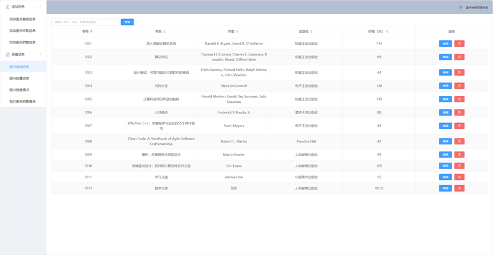
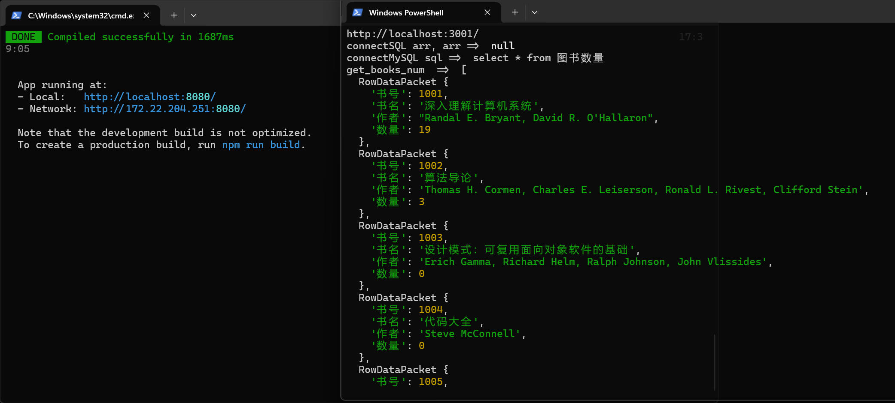

# 图书销售管理系统

这是一个数据库课程设计项目，包含 Vue 管理页面、Express API 和 MySQL
数据模型。系统支持图书基础信息维护、采购/销售登记、库存查看和月度销售统计。





## 技术结构

- 前端：Vue 2.7、Vue Router、Element UI、Axios
- 后端：Node.js、Express 5、`mysql2/promise`
- 数据库：MySQL 8，结构和样例数据见 `other/librarymanagement.sql`

模块边界和数据流见 [docs/architecture.md](docs/architecture.md)，接口约定见
[docs/api.md](docs/api.md)，重构进度和剩余债务见
[docs/refactor-plan.md](docs/refactor-plan.md)，容器生命周期、持久化和回滚见
[docs/container-deployment.md](docs/container-deployment.md)。

## 容器一键部署

唯一启动入口是 `compose.yaml`。Windows 推荐把仓库直接克隆到 Ubuntu WSL 2 的
Linux 文件系统，不要把 `/mnt/c` 下的 Windows 工作区作为部署目录：

```sh
mkdir -p "$HOME/src" && \
HTTPS_PROXY=http://127.0.0.1:12334 git clone --branch refactor/engineering-baseline --single-branch https://github.com/LiuLin1220/librarymanagement.git "$HOME/src/librarymanagement" && \
cd "$HOME/src/librarymanagement"
```

确保 WSL 内的 Docker Engine 和 Compose plugin 已启动，且 Docker 守护进程可以
通过 `http://127.0.0.1:12334` 拉取镜像。然后直接执行：

```sh
docker compose up -d
```

不需要先创建 `.env`、密码文件或运行仓库脚本。Compose 会自动完成以下工作：

- 每次根据当前代码构建 Vue/Express 应用镜像；构建阶段默认使用 12334 代理。
- 首次启动时在 Docker 命名卷中生成随机数据库密码，不把密码写入仓库或环境值。
- 初始化 MySQL 数据卷并导入 `other/librarymanagement.sql`。
- 等 MySQL 健康后启动应用，只向宿主机开放 `127.0.0.1:8080`。

停止服务但保留数据库卷：

```sh
docker compose down
```

详细影响、回滚和删除数据前的警告见
[容器化部署说明](docs/container-deployment.md)。

## 本地开发环境要求

- Node.js 22 LTS（`.nvmrc` 和 CI 使用该版本）
- npm 10 或更高版本
- MySQL 8（仅真实数据库运行需要；lint 和单元测试不需要数据库）

## 安装

```powershell
npm ci
```

## 配置

复制环境变量模板：

```powershell
Copy-Item -LiteralPath '.env.example' -Destination '.env.local'
```

然后编辑 `.env.local`，至少填写 `DB_USER`、`DB_PASSWORD` 和 `DB_NAME`。
真实凭据只放在本地环境文件中，不要提交到 Git。

数据库结构不会由应用自动创建。请在确认实际 MySQL 实例和目标数据库后，将
`other/librarymanagement.sql` 导入与 `DB_NAME` 一致的数据库。该脚本会删除并重建
同名表、视图、存储过程和触发器，不能对未知或已有重要数据的数据库直接执行。

## 运行

启动后端 API：

```powershell
npm start
```

另开终端启动前端开发服务器：

```powershell
npm run serve
```

默认地址：前端 `http://localhost:8080`，后端 `http://localhost:3001`。如需修改，
使用 `.env.local` 中的 `PORT`、`CORS_ORIGIN` 和 `VUE_APP_API_BASE_URL`。

## 验证

运行 lint 和不依赖数据库的 API 契约测试：

```powershell
npm run check
```

测试通过注入假的数据仓库验证成功、空列表、输入错误、记录不存在和数据库异常等
响应，并检查容器交付资产的关键约束。它不代表镜像已构建，也不代表 MySQL 视图、
触发器和存储过程已经完成真实容器验证。

## 主要目录

```text
src/api/                 前端 HTTP 边界
src/components/          可复用表单组件
src/views/               页面组件
server/config/           环境配置和连接池
server/routes/           HTTP 输入与响应
server/repositories/     SQL 和字段映射
test/server/             数据库无关测试
compose.yaml             唯一部署入口、应用、数据库、secret、健康检查和数据卷
other/librarymanagement.sql  数据库结构与样例数据
```

## 当前边界

本轮重构保留了原页面路径和后端 API 路径。Vue 2 已结束官方维护，因此 Vue 3 +
Vite 迁移被记录为独立后续工作；它不与本轮行为保持型重构混在一起。
